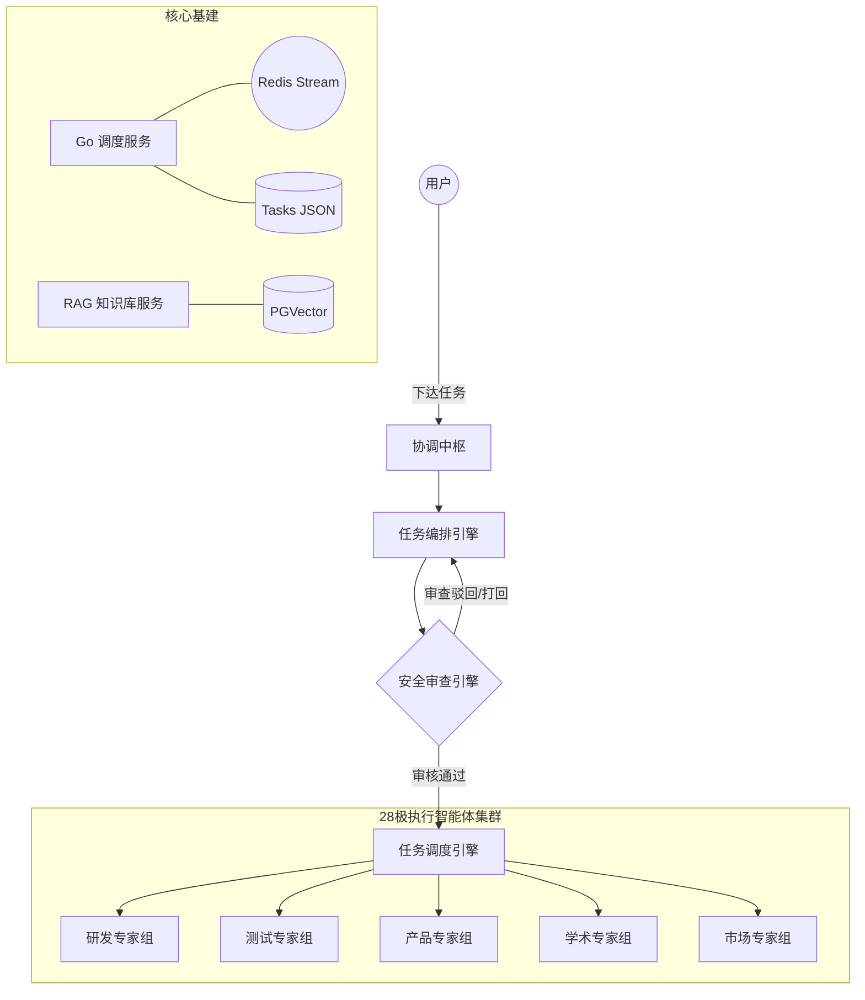

# 🏛️ OpenClaw MAS (Multi-Agent System)

> **基于 OpenClaw 驱动的工业级多智能体协同与调度系统**
>
> 本项目将现代软件工程的「分权制衡」思想与 OpenClaw 的 Agent 能力相结合，构建了一个包含**指挥中枢、自动化编排、安全审查与并行执行**的完整 MAS 平台。

---

## 🌟 核心特性

- **指挥-执行分离架构**：
  - **指挥层**：基于 OpenClaw 的 `coordinator`, `planner`, `reviewer`, `dispatcher` 四大引擎，负责复杂任务的模糊识别、意图拆解、方案风控与指令派发。
  - **执行层**：由 **28 个极领域专家智能体** (Agency Experts) 组成的动态集群，涵盖研发、测试、产品、学术、市场五个大类，负责细分领域的专业交付。
- **高可用 Go 调度引擎**：使用 Go 语言重构的高性能系统总线，基于 Redis Streams 实现事件驱动的任务状态机，确保任务流转的确定性。
- **Agentic RAG 知识库**：集成 PostgreSQL (pgvector) + HyDE (虚拟文档生成) + RRF (混合搜索)，为 Agent 提供全局实时的知识检索能力。
- **实时监控看板**：基于 React 18 + WebSockets 的全透明监控台，实时观测 Agent 的思考过程（Thinking）、工具调用与任务进度。

---

## 🏗️ 系统架构

---

### 1. 基础环境
确保本地已安装 `Go 1.21+`, `Python 3.11+`, `Docker` 以及 `OpenClaw`。

1. 生产环境一键部署 (推荐)

配置密钥： 在根目录下创建 .env 文件（或修改已有的），确保填入以下关键 API Key：
SILICONFLOW_API_KEY=你的硅基流动KEY
TAVILY_API_KEY=你的搜索KEY
JWT_SECRET=一个随机的长字符串
一键启动： 在根目录下执行：
docker-compose -f docker-compose.prod.yml up -d
验证状态： 启动后，访问 http://localhost:80 (或 Caddy 指定的域名) 即可看到看板。

2. 开发者模式部署 (源码级手动)
如果你需要进行开发调试，可以使用 install.sh脚本进行本地安装：
环境检查： 确保本地已安装 Go 1.21+、Python 3.11+ 和 Node.js 18+。安装 openclaw CLI 工具。
运行安装脚本：
bash
bash install.sh
该脚本会自动：
创建 Agent 专属的 workspace。
在 OpenClaw 中自动注册所有异构智能体服务。
初始化预设任务队列。
构建 React 前端产物。
分别启动服务：
终端 A (调度层)：cd edict-go && go run main.go
终端 B (RAG 层)：cd edict/backend && uvicorn app.main:app --reload
终端 C (看板服务器)：python3 dashboard/server.py
3. 部署后关键验证
部署完成后，建议执行以下三项检查确保 RAG 链路通畅：

数据库初始化：访问 /healthz 检查 Postgres 连接是否正常，特别是 pgvector 扩展是否已激活。
模型联通性：在前端看板发送测试提问，观察 python-api 的日志，确认 

rewrite_query
 和 

hybrid_search
 是否已正确调用硅基流动接口。
实时同步：确认 

scripts/refresh_live_data.py
 循环正在运行，这是 Agent 思考过程（Thought Stream）能够实时推送到看板的关键。

## 📂 项目结构

- **`edict-go/`**: 高性能任务调度引擎与 WebSocket 网关。
- **`edict/backend/`**: 核心 RAG 知识服务与 Python 业务逻辑。
- **`edict/frontend/`**: 响应式管理看板前端。
- **`agents/`**: OpenClaw 各引擎的人格定义（SOUL.md）与工作协议。
- **`scripts/`**: 运维及同步辅助工具集。

