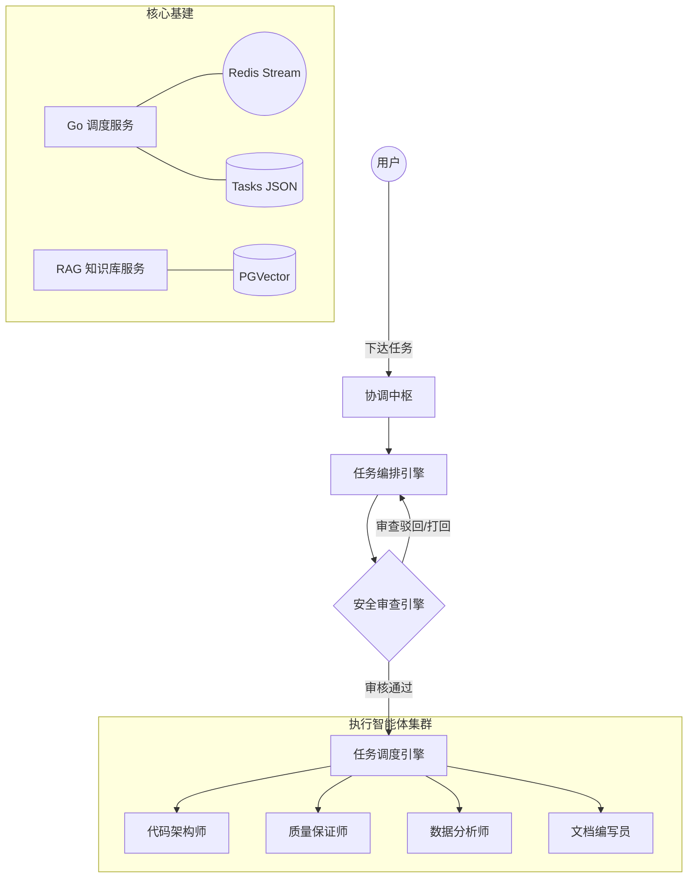

# 🏛️ OpenClaw MAS (Multi-Agent System)

> **基于 OpenClaw 驱动的工业级多智能体协同与调度系统**
>
> 本项目将现代软件工程的「分权制衡」思想与 OpenClaw 的 Agent 能力相结合，构建了一个包含**指挥中枢、自动化编排、安全审查与并行执行**的完整 MAS 平台。

---

## 🌟 核心特性

- **指挥-执行分离架构**：
  - **指挥层**：基于 OpenClaw 的 `coordinator`, `planner`, `reviewer`, `dispatcher` 四大引擎，负责复杂任务的模糊识别、意图拆解、方案风控与指令派发。
  - **执行层**：精简高效的 4 大专职 Agent (`software_engineer`, `qa_engineer`, `data_analyst`, `doc_writer`)，负责垂直领域的具体交付。
- **高可用 Go 调度引擎**：使用 Go 语言重构的高性能系统总线，基于 Redis Streams 实现事件驱动的任务状态机，确保任务流转的确定性。
- **Agentic RAG 知识库**：集成 PostgreSQL (pgvector) + HyDE (虚拟文档生成) + RRF (混合搜索)，为 Agent 提供全局实时的知识检索能力。
- **实时监控看板**：基于 React 18 + WebSockets 的全透明监控台，实时观测 Agent 的思考过程（Thinking）、工具调用与任务进度。

---

## 🏗️ 系统架构



---


### 1. 基础环境
确保本地已安装 `Go 1.21+`, `Python 3.11+`, `Docker` 以及 `OpenClaw`。

### 2. 启动基础服务
使用 Docker 一键拉起持久化层（Redis & Pgvector）：
```bash
docker compose -f docker-compose.dev.yml up -d
```

### 3. 一键初始化集群
运行安装脚本，自动注册 Agent 到 OpenClaw 并配置工作协议：
```bash
chmod +x install.sh && ./install.sh
```

### 4. 启动后端组件
**终端 A (RAG 服务):**
```bash
cd edict/backend && pip install -r requirements.txt
uvicorn app.main:app --port 8000
```

**终端 B (Go 调度大盘):**
```bash
cd edict-go && go run main.go --port 7891
```

### 5. 访问看板
打开浏览器访问：[http://localhost:7891](http://localhost:7891)

---

## 🛠️ 配置说明

在 `edict/backend/app/.env` 中配置你的模型 API 密钥：
Agent 的模型切换可通过看板界面一键完成。

---

## 📂 项目结构

- **`edict-go/`**: 高性能任务调度引擎与 WebSocket 网关。
- **`edict/backend/`**: 核心 RAG 知识服务与 Python 业务逻辑。
- **`edict/frontend/`**: 响应式管理看板前端。
- **`agents/`**: OpenClaw 各引擎的人格定义（SOUL.md）与工作协议。
- **`scripts/`**: 运维及同步辅助工具集。

